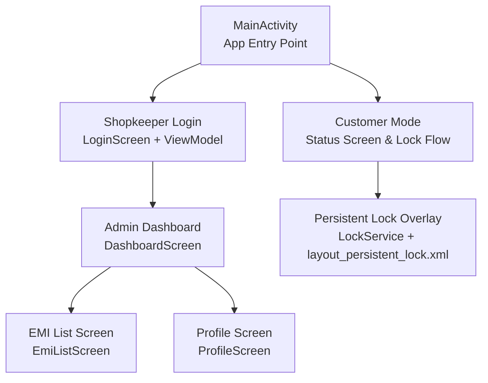
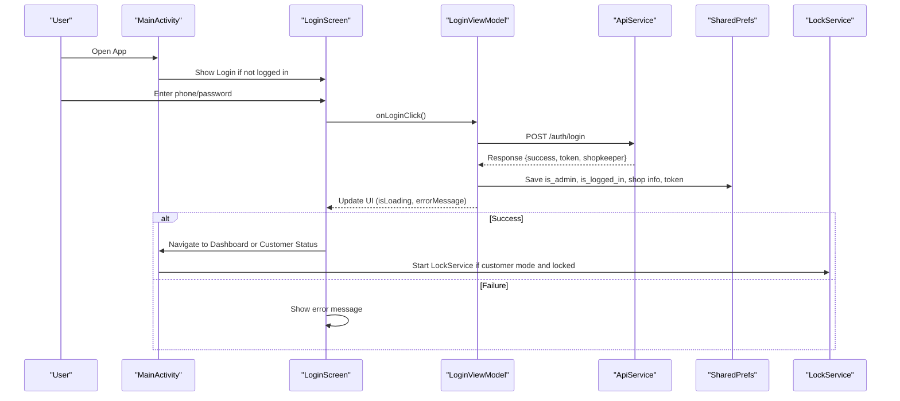
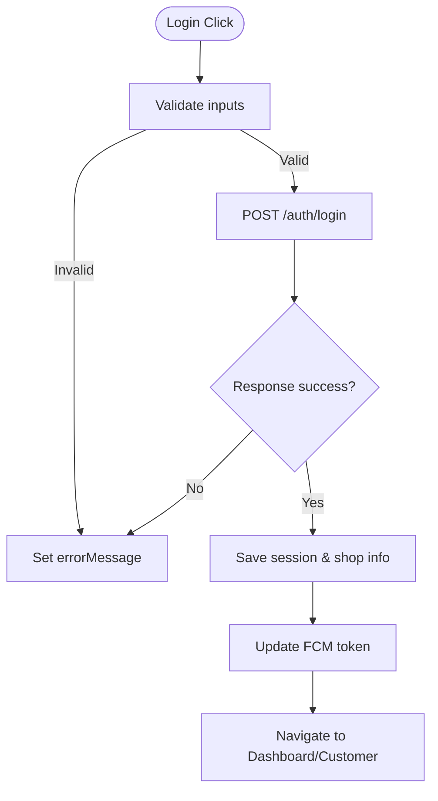
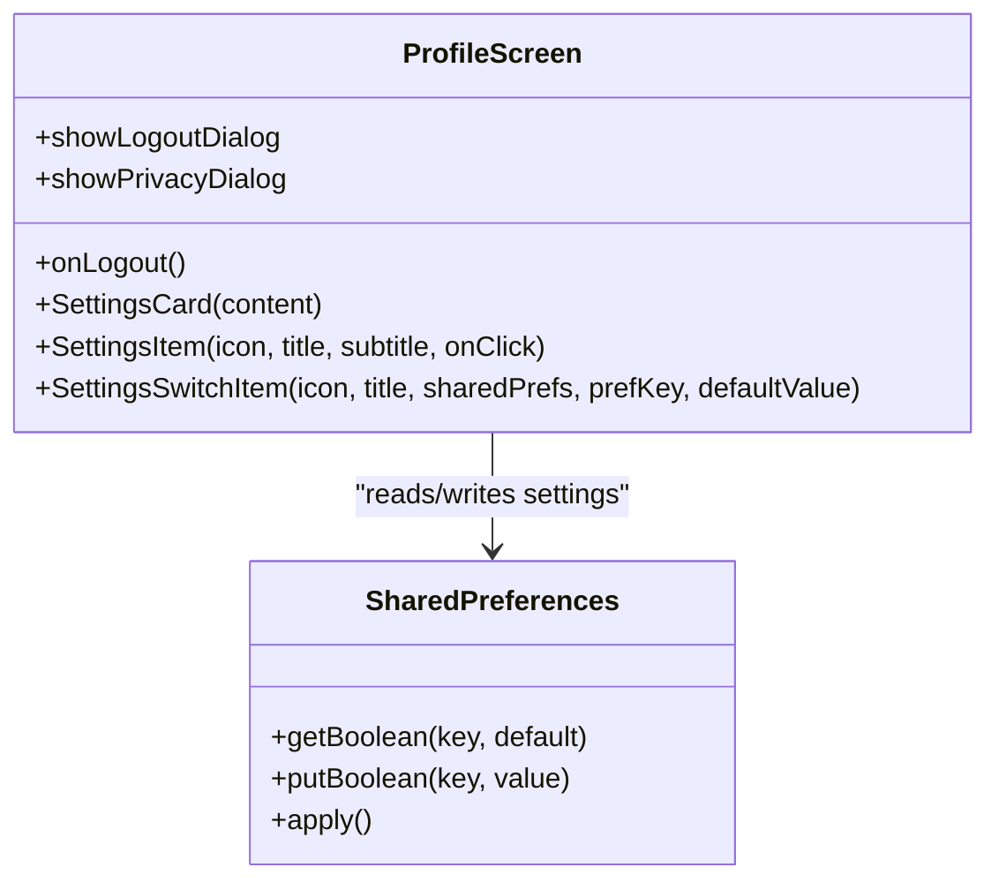
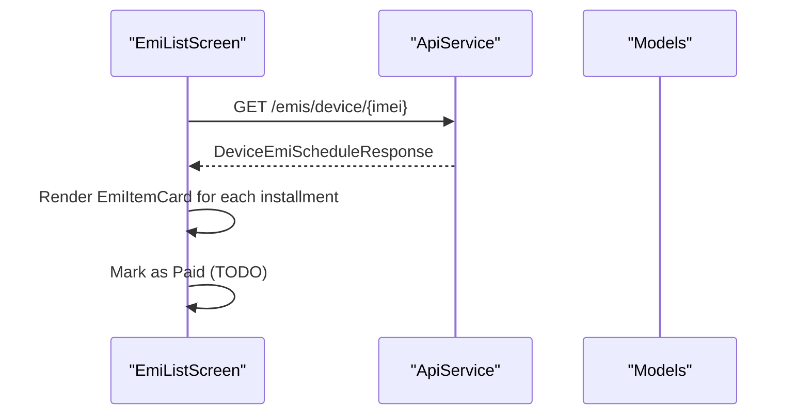
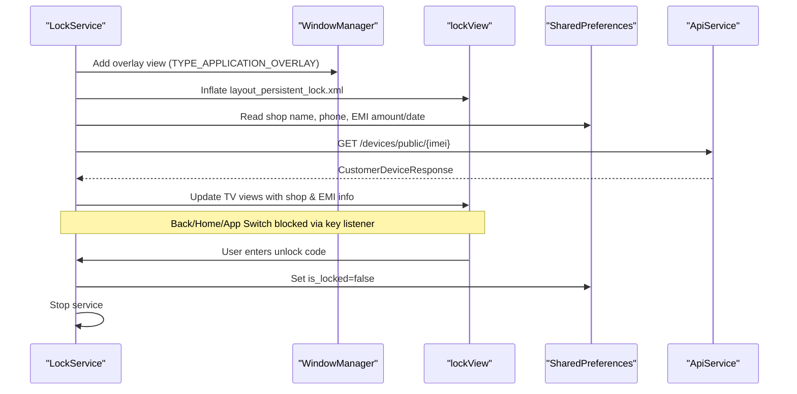
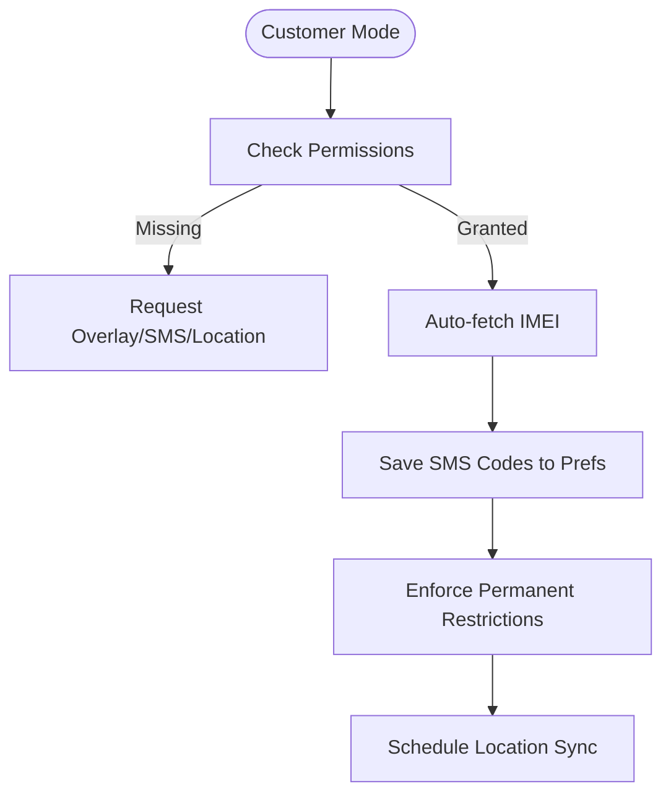
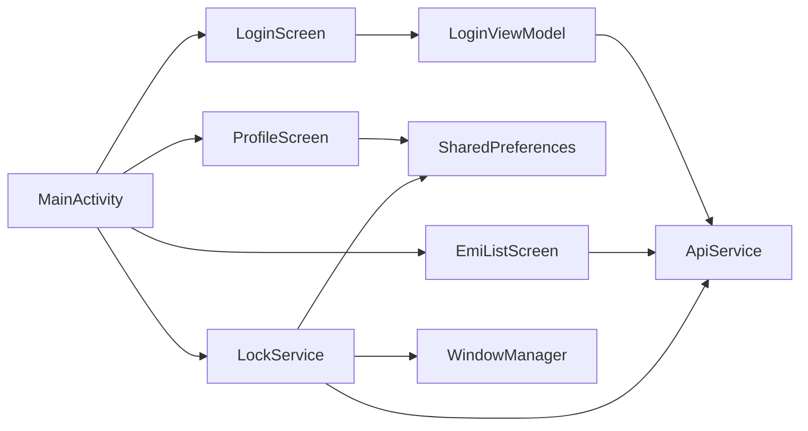

# Customer Interface

<cite>
**Referenced Files in This Document**
- [MainActivity.kt](file://app/src/main/java/com/pksafe/lock/manager/MainActivity.kt)
- [LoginScreen.kt](file://app/src/main/java/com/pksafe/lock/manager/ui/login/LoginScreen.kt)
- [LoginViewModel.kt](file://app/src/main/java/com/pksafe/lock/manager/ui/login/LoginViewModel.kt)
- [ProfileScreen.kt](file://app/src/main/java/com/pksafe/lock/manager/ui/profile/ProfileScreen.kt)
- [EmiListScreen.kt](file://app/src/main/java/com/pksafe/lock/manager/ui/emi/EmiListScreen.kt)
- [layout_persistent_lock.xml](file://app/src/main/res/layout/layout_persistent_lock.xml)
- [LockService.kt](file://app/src/main/java/com/pksafe/lock/manager/service/LockService.kt)
- [ApiService.kt](file://app/src/main/java/com/pksafe/lock/manager/data/ApiService.kt)
- [Models.kt](file://app/src/main/java/com/pksafe/lock/manager/data/Models.kt)
- [accessibility_service_config.xml](file://app/src/main/res/xml/accessibility_service_config.xml)
</cite>

## Table of Contents
1. Introduction
2. Project Structure
3. Core Components
4. Architecture Overview
5. Detailed Component Analysis
6. Dependency Analysis
7. Performance Considerations
8. Troubleshooting Guide
9. Conclusion
10. Appendices

## Introduction
This document describes the customer-facing user interface components for PK Locker, focused on end-users who have locked devices. It covers:
- Login and authentication screens for shopkeeper/admin access to manage devices and view status
- Profile management interface for account details and settings
- EMI payment tracking screen showing schedules, due dates, and actions
- Persistent lock screen overlay that prevents unauthorized access while displaying payment status and unlock instructions
- User interaction patterns, error handling for network issues, offline capability support
- Example workflows from initial setup through payment completion and device unlocking
- Accessibility compliance and UX considerations for diverse users

## Project Structure
The customer-facing UI is implemented using Android Jetpack Compose for modern screens and a persistent XML-based overlay for the lock screen. The main entry point routes between customer mode (device owner with enforced restrictions), shopkeeper login, and admin dashboard.

**Diagram sources**
- [MainActivity.kt:126-445](file://app/src/main/java/com/pksafe/lock/manager/MainActivity.kt#L126-L445)
- [LoginScreen.kt:39-215](file://app/src/main/java/com/pksafe/lock/manager/ui/login/LoginScreen.kt#L39-L215)
- [EmiListScreen.kt:37-98](file://app/src/main/java/com/pksafe/lock/manager/ui/emi/EmiListScreen.kt#L37-L98)
- [ProfileScreen.kt:36-242](file://app/src/main/java/com/pksafe/lock/manager/ui/profile/ProfileScreen.kt#L36-L242)
- [LockService.kt:50-80](file://app/src/main/java/com/pksafe/lock/manager/service/LockService.kt#L50-L80)
- [layout_persistent_lock.xml:1-234](file://app/src/main/res/layout/layout_persistent_lock.xml#L1-L234)

**Section sources**
- [MainActivity.kt:126-445](file://app/src/main/java/com/pksafe/lock/manager/MainActivity.kt#L126-L445)

## Core Components
- Login and Authentication: Shopkeeper login flow with validation, network calls, and session persistence
- Profile Management: Merchant details, security credentials placeholder, preferences toggles, legal & privacy dialog
- EMI Tracking: Upcoming EMIs list with device info, due dates, amounts, and mark-as-paid action
- Persistent Lock Overlay: Foreground service overlay preventing back/home/app switch, showing EMI status and unlock code input
- Data Layer: Retrofit API service and data models for auth, devices, EMI schedules, and customer responses

Key responsibilities:
- Enforce device restrictions for customers via Device Owner and Accessibility services
- Provide seamless offline fallbacks by caching SMS codes and EMI info
- Maintain secure state transitions between locked/unlocked modes

**Section sources**
- [LoginScreen.kt:39-215](file://app/src/main/java/com/pksafe/lock/manager/ui/login/LoginScreen.kt#L39-L215)
- [LoginViewModel.kt:15-88](file://app/src/main/java/com/pksafe/lock/manager/ui/login/LoginViewModel.kt#L15-L88)
- [ProfileScreen.kt:36-242](file://app/src/main/java/com/pksafe/lock/manager/ui/profile/ProfileScreen.kt#L36-L242)
- [EmiListScreen.kt:37-269](file://app/src/main/java/com/pksafe/lock/manager/ui/emi/EmiListScreen.kt#L37-L269)
- [LockService.kt:50-330](file://app/src/main/java/com/pksafe/lock/manager/service/LockService.kt#L50-L330)
- [ApiService.kt:11-185](file://app/src/main/java/com/pksafe/lock/manager/data/ApiService.kt#L11-L185)
- [Models.kt:45-175](file://app/src/main/java/com/pksafe/lock/manager/data/Models.kt#L45-L175)

## Architecture Overview
The app uses a layered architecture:
- UI Layer: Compose screens for login, profile, EMI list; XML overlay for lock screen
- State Management: ViewModels and Shared Preferences for session and settings
- Service Layer: Foreground LockService managing overlay and auto-lock behavior
- Data Layer: Retrofit ApiService with typed models for server communication

**Diagram sources**
- [LoginScreen.kt:39-215](file://app/src/main/java/com/pksafe/lock/manager/ui/login/LoginScreen.kt#L39-L215)
- [LoginViewModel.kt:15-88](file://app/src/main/java/com/pksafe/lock/manager/ui/login/LoginViewModel.kt#L15-L88)
- [ApiService.kt:11-185](file://app/src/main/java/com/pksafe/lock/manager/data/ApiService.kt#L11-L185)
- [MainActivity.kt:126-445](file://app/src/main/java/com/pksafe/lock/manager/MainActivity.kt#L126-L445)
- [LockService.kt:50-80](file://app/src/main/java/com/pksafe/lock/manager/service/LockService.kt#L50-L80)

## Detailed Component Analysis

### Login and Authentication Screens
- Purpose: Authenticate shopkeepers, persist session, update FCM token, and route to appropriate screens
- Key behaviors:
  - Input validation and loading states
  - Network call to login endpoint
  - Store admin role, shop info, token, and reset customer flags
  - Error messages for invalid credentials or connection failures
- UI elements:
  - Phone number and password fields with keyboard types
  - Sign-in button with loading indicator
  - Navigation to signup and customer setup

**Diagram sources**
- [LoginViewModel.kt:30-88](file://app/src/main/java/com/pksafe/lock/manager/ui/login/LoginViewModel.kt#L30-L88)
- [ApiService.kt:11-185](file://app/src/main/java/com/pksafe/lock/manager/data/ApiService.kt#L11-L185)

**Section sources**
- [LoginScreen.kt:39-215](file://app/src/main/java/com/pksafe/lock/manager/ui/login/LoginScreen.kt#L39-L215)
- [LoginViewModel.kt:15-88](file://app/src/main/java/com/pksafe/lock/manager/ui/login/LoginViewModel.kt#L15-L88)

### Profile Management Interface
- Purpose: Display merchant details, provide settings toggles, and show legal & privacy information
- Key behaviors:
  - Read shop name from preferences
  - Toggle critical alerts and auto-lock protocol
  - Launch technical support dialer
  - Show privacy dialog with terms and liability notices
  - Confirm logout with destructive action

**Diagram sources**
- [ProfileScreen.kt:36-242](file://app/src/main/java/com/pksafe/lock/manager/ui/profile/ProfileScreen.kt#L36-L242)

**Section sources**
- [ProfileScreen.kt:36-242](file://app/src/main/java/com/pksafe/lock/manager/ui/profile/ProfileScreen.kt#L36-L242)

### EMI Payment Tracking Screen
- Purpose: Display upcoming EMIs per device with due dates, amounts, and actions
- Key behaviors:
  - Render list of devices with customer info and status
  - Format currency using locale
  - Show next due date and total loan amount
  - Placeholder for marking EMI as paid

**Diagram sources**
- [EmiListScreen.kt:37-269](file://app/src/main/java/com/pksafe/lock/manager/ui/emi/EmiListScreen.kt#L37-L269)
- [ApiService.kt:111-129](file://app/src/main/java/com/pksafe/lock/manager/data/ApiService.kt#L111-L129)
- [Models.kt:123-175](file://app/src/main/java/com/pksafe/lock/manager/data/Models.kt#L123-L175)

**Section sources**
- [EmiListScreen.kt:37-269](file://app/src/main/java/com/pksafe/lock/manager/ui/emi/EmiListScreen.kt#L37-L269)

### Persistent Lock Screen Overlay
- Purpose: Prevent unauthorized access when device is locked; display EMI status and unlock instructions
- Key behaviors:
  - Foreground service with notification channel
  - Overlay window with system flags to block back/home/app switch
  - Hidden unlock code entry triggered by tapping a subtle text
  - Dynamic master code derived from IMEI last 6 digits (fallback to default)
  - Live refresh of EMI data from server and cache fallback
  - Auto-lock on connectivity loss if enabled

**Diagram sources**
- [LockService.kt:50-330](file://app/src/main/java/com/pksafe/lock/manager/service/LockService.kt#L50-L330)
- [layout_persistent_lock.xml:1-234](file://app/src/main/res/layout/layout_persistent_lock.xml#L1-L234)
- [ApiService.kt:101-109](file://app/src/main/java/com/pksafe/lock/manager/data/ApiService.kt#L101-L109)

**Section sources**
- [LockService.kt:50-330](file://app/src/main/java/com/pksafe/lock/manager/service/LockService.kt#L50-L330)
- [layout_persistent_lock.xml:1-234](file://app/src/main/res/layout/layout_persistent_lock.xml#L1-L234)

### Customer Setup and Status Screen
- Purpose: Guide customers through required permissions and enforce permanent restrictions
- Key behaviors:
  - Check and request overlay permission, SMS permission, location permission
  - Auto-fetch IMEI if device owner and save SMS codes for offline use
  - Enforce permanent restrictions for customers (block factory reset, USB, debugging)
  - Trigger background location sync periodically

**Diagram sources**
- [MainActivity.kt:126-445](file://app/src/main/java/com/pksafe/lock/manager/MainActivity.kt#L126-L445)

**Section sources**
- [MainActivity.kt:126-445](file://app/src/main/java/com/pksafe/lock/manager/MainActivity.kt#L126-L445)

## Dependency Analysis
- UI components depend on ViewModels and Shared Preferences for state
- Login flow depends on ApiService for authentication and token updates
- LockService depends on WindowManager, SharedPreferences, and ApiService for live data
- EMI screen depends on ApiService and Models for schedule data
- Accessibility service configuration enables essential device synchronization and security features

**Diagram sources**
- [LoginScreen.kt:39-215](file://app/src/main/java/com/pksafe/lock/manager/ui/login/LoginScreen.kt#L39-L215)
- [LoginViewModel.kt:15-88](file://app/src/main/java/com/pksafe/lock/manager/ui/login/LoginViewModel.kt#L15-L88)
- [ProfileScreen.kt:36-242](file://app/src/main/java/com/pksafe/lock/manager/ui/profile/ProfileScreen.kt#L36-L242)
- [EmiListScreen.kt:37-269](file://app/src/main/java/com/pksafe/lock/manager/ui/emi/EmiListScreen.kt#L37-L269)
- [LockService.kt:50-330](file://app/src/main/java/com/pksafe/lock/manager/service/LockService.kt#L50-L330)
- [MainActivity.kt:126-445](file://app/src/main/java/com/pksafe/lock/manager/MainActivity.kt#L126-L445)

**Section sources**
- [ApiService.kt:11-185](file://app/src/main/java/com/pksafe/lock/manager/data/ApiService.kt#L11-L185)
- [Models.kt:45-175](file://app/src/main/java/com/pksafe/lock/manager/data/Models.kt#L45-L175)

## Performance Considerations
- Use foreground service for lock overlay to ensure persistence and visibility
- Perform network calls on IO threads and post UI updates on main thread
- Cache EMI and shop info in SharedPreferences to reduce network dependency
- Avoid blocking UI during IMEI fetch and permission checks
- Minimize overlay redraws by updating only necessary TextViews

[No sources needed since this section provides general guidance]

## Troubleshooting Guide
Common issues and resolutions:
- Invalid credentials: Check phone number and password; verify server availability
- Connection failed: Ensure internet connectivity; retry after network restoration
- Missing overlay permission: Guide user to grant “Display over other apps”
- SMS permission missing: Prompt user to allow SMS for offline locking
- Location permission missing: Allow background location for periodic updates
- Unlock code invalid: Verify dynamic master code based on IMEI; fallback to default if IMEI invalid

**Section sources**
- [LoginViewModel.kt:30-88](file://app/src/main/java/com/pksafe/lock/manager/ui/login/LoginViewModel.kt#L30-L88)
- [MainActivity.kt:217-325](file://app/src/main/java/com/pksafe/lock/manager/MainActivity.kt#L217-L325)
- [LockService.kt:190-218](file://app/src/main/java/com/pksafe/lock/manager/service/LockService.kt#L190-L218)

## Conclusion
PK Locker’s customer interface combines robust authentication, clear profile management, actionable EMI tracking, and a resilient lock overlay to protect devices while providing transparent payment status and unlock instructions. The architecture emphasizes offline resilience, strict security enforcement, and accessible user flows suitable for diverse demographics.

[No sources needed since this section summarizes without analyzing specific files]

## Appendices

### Accessibility Compliance
- Accessibility service configured to enable essential device synchronization and security features
- Descriptions provided for accessibility usage to inform users about functionality

**Section sources**
- [accessibility_service_config.xml:1-8](file://app/src/main/res/xml/accessibility_service_config.xml#L1-L8)
- [strings.xml:1-5](file://app/src/main/res/values/strings.xml#L1-L5)

### Example Customer Workflows
- Initial Setup:
  - Customer enters IMEI; app fetches SMS codes and shop info
  - Permissions requested and granted for overlay, SMS, and location
  - Permanent restrictions enforced to prevent tampering
- Payment Completion:
  - EMI list shows upcoming payments and due dates
  - Mark as paid action triggers backend update (placeholder)
  - Lock overlay updates with fresh EMI data
- Device Unlocking:
  - Customer taps hidden unlock entry field
  - Enters dynamic master code derived from IMEI
  - Device unlocked and restrictions removed

[No sources needed since this section outlines conceptual workflows]