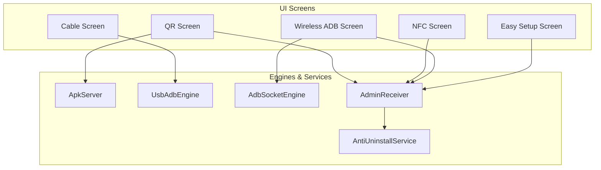
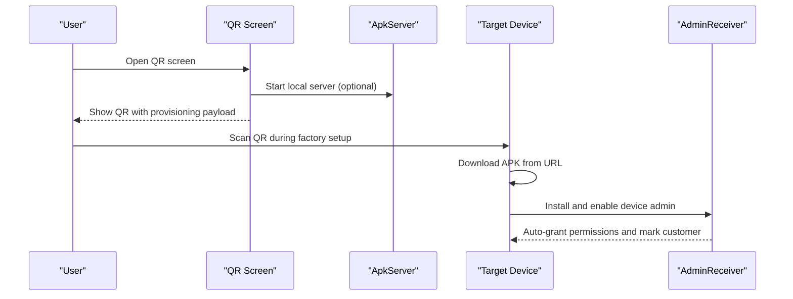
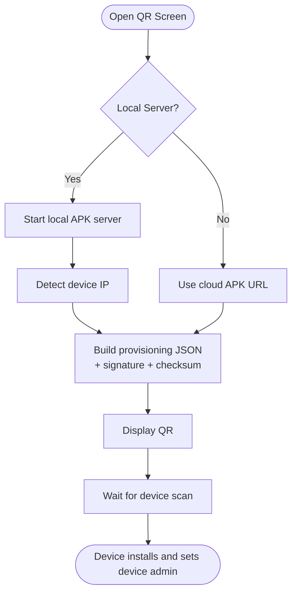
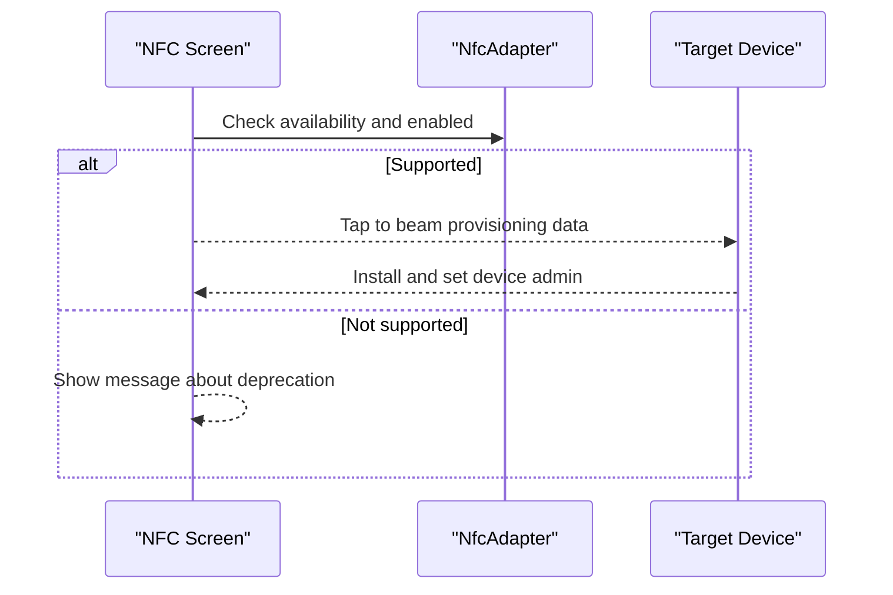
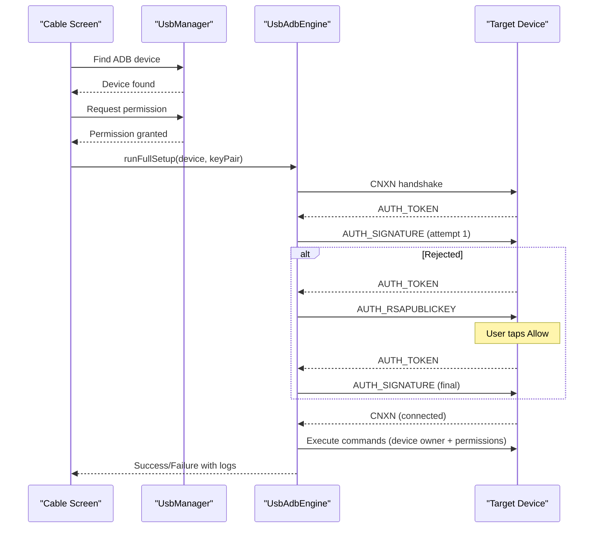
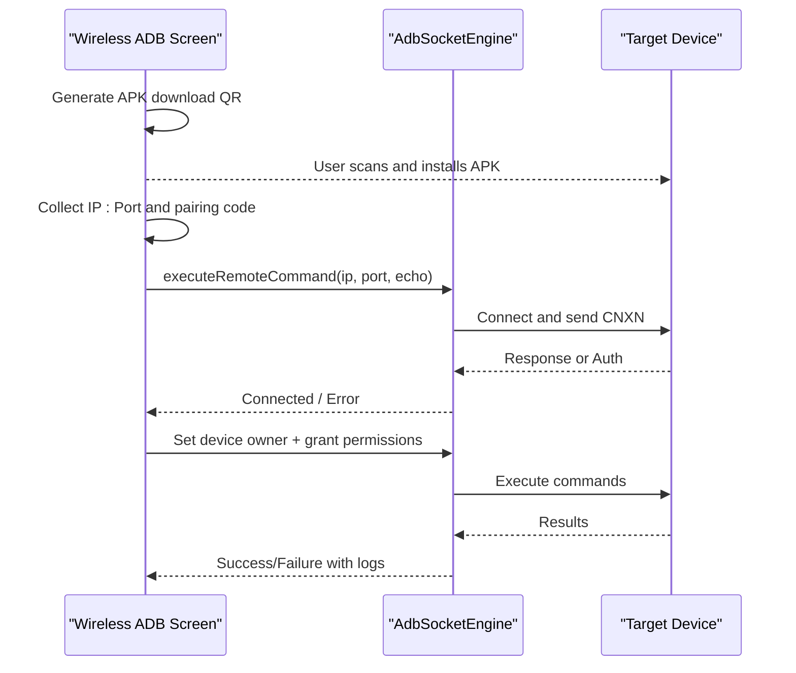
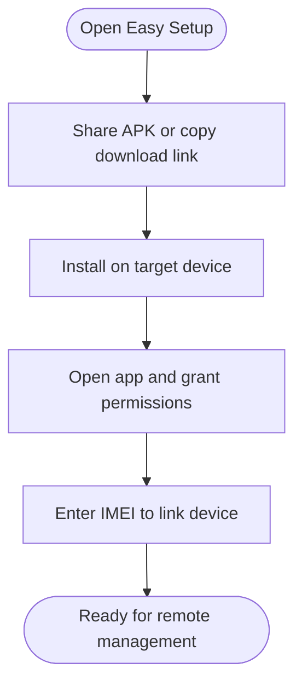
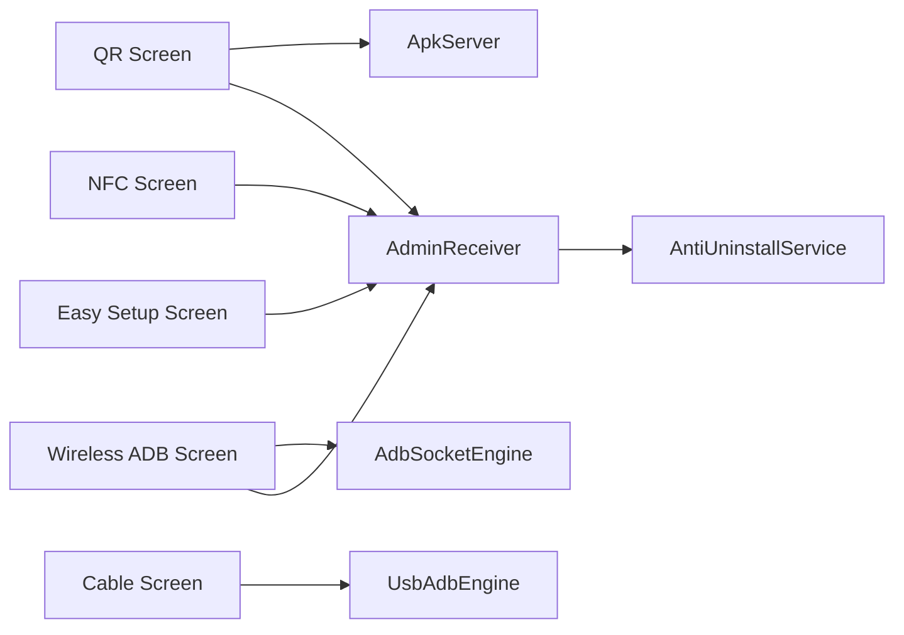

# Provisioning Workflows

<cite>
**Referenced Files in This Document**
- [ProvisioningQrScreen.kt](file://app/src/main/java/com/pksafe/lock/manager/ui/provisioning/ProvisioningQrScreen.kt)
- [NfcSetupScreen.kt](file://app/src/main/java/com/pksafe/lock/manager/ui/provisioning/NfcSetupScreen.kt)
- [ProvisioningCableScreen.kt](file://app/src/main/java/com/pksafe/lock/manager/ui/provisioning/ProvisioningCableScreen.kt)
- [WirelessAdbSetupScreen.kt](file://app/src/main/java/com/pksafe/lock/manager/ui/provisioning/WirelessAdbSetupScreen.kt)
- [EasySetupScreen.kt](file://app/src/main/java/com/pksafe/lock/manager/ui/provisioning/EasySetupScreen.kt)
- [NfcProvisioner.kt](file://app/src/main/java/com/pksafe/lock/manager/util/NfcProvisioner.kt)
- [UsbAdbEngine.kt](file://app/src/main/java/com/pksafe/lock/manager/util/UsbAdbEngine.kt)
- [AdbSocketEngine.kt](file://app/src/main/java/com/pksafe/lock/manager/util/AdbSocketEngine.kt)
- [ApkServer.kt](file://app/src/main/java/com/pksafe/lock/manager/util/ApkServer.kt)
- [AdminReceiver.kt](file://app/src/main/java/com/pksafe/lock/manager/receiver/AdminReceiver.kt)
- [AntiUninstallService.kt](file://app/src/main/java/com/pksafe/lock/manager/service/AntiUninstallService.kt)
- [Constants.kt](file://app/src/main/java/com/pksafe/lock/manager/util/Constants.kt)
</cite>

## Table of Contents
1. Introduction
2. Project Structure
3. Core Components
4. Architecture Overview
5. Detailed Component Analysis
6. Dependency Analysis
7. Performance Considerations
8. Troubleshooting Guide
9. Conclusion

## Introduction
This document explains PK Locker’s device provisioning system interfaces and their technical implementation. It covers five enrollment methods:
- QR code provisioning for contactless setup
- NFC-based setup (where supported)
- Cable connection via USB with ADB activation
- Wireless ADB for remote debugging and installation
- Easy Setup wizard for first-time users without a laptop

For each method, we describe the user workflow, technical flow, error handling, fallbacks, and compatibility considerations across Android versions and manufacturers.

## Project Structure
The provisioning UI is implemented as Compose screens under the provisioning package. Each screen orchestrates one or more utility engines to perform the actual provisioning tasks. Supporting components include:
- Local APK server for QR downloads
- USB ADB engine for cable-based setup
- ADB socket client for wireless ADB
- Device admin receiver to finalize provisioning and auto-grant permissions
- Anti-uninstall accessibility service to protect settings and enforce policies

**Diagram sources**
- [ProvisioningQrScreen.kt:40-170](file://app/src/main/java/com/pksafe/lock/manager/ui/provisioning/ProvisioningQrScreen.kt#L40-L170)
- [NfcSetupScreen.kt:27-45](file://app/src/main/java/com/pksafe/lock/manager/ui/provisioning/NfcSetupScreen.kt#L27-L45)
- [ProvisioningCableScreen.kt:87-170](file://app/src/main/java/com/pksafe/lock/manager/ui/provisioning/ProvisioningCableScreen.kt#L87-L170)
- [WirelessAdbSetupScreen.kt:51-100](file://app/src/main/java/com/pksafe/lock/manager/ui/provisioning/WirelessAdbSetupScreen.kt#L51-L100)
- [EasySetupScreen.kt:40-66](file://app/src/main/java/com/pksafe/lock/manager/ui/provisioning/EasySetupScreen.kt#L40-L66)
- [ApkServer.kt:14-44](file://app/src/main/java/com/pksafe/lock/manager/util/ApkServer.kt#L14-L44)
- [UsbAdbEngine.kt:18-46](file://app/src/main/java/com/pksafe/lock/manager/util/UsbAdbEngine.kt#L18-L46)
- [AdbSocketEngine.kt:13-30](file://app/src/main/java/com/pksafe/lock/manager/util/AdbSocketEngine.kt#L13-L30)
- [AdminReceiver.kt:14-36](file://app/src/main/java/com/pksafe/lock/manager/receiver/AdminReceiver.kt#L14-L36)
- [AntiUninstallService.kt:22-80](file://app/src/main/java/com/pksafe/lock/manager/service/AntiUninstallService.kt#L22-L80)

**Section sources**
- [ProvisioningQrScreen.kt:40-170](file://app/src/main/java/com/pksafe/lock/manager/ui/provisioning/ProvisioningQrScreen.kt#L40-L170)
- [NfcSetupScreen.kt:27-45](file://app/src/main/java/com/pksafe/lock/manager/ui/provisioning/NfcSetupScreen.kt#L27-L45)
- [ProvisioningCableScreen.kt:87-170](file://app/src/main/java/com/pksafe/lock/manager/ui/provisioning/ProvisioningCableScreen.kt#L87-L170)
- [WirelessAdbSetupScreen.kt:51-100](file://app/src/main/java/com/pksafe/lock/manager/ui/provisioning/WirelessAdbSetupScreen.kt#L51-L100)
- [EasySetupScreen.kt:40-66](file://app/src/main/java/com/pksafe/lock/manager/ui/provisioning/EasySetupScreen.kt#L40-L66)
- [ApkServer.kt:14-44](file://app/src/main/java/com/pksafe/lock/manager/util/ApkServer.kt#L14-L44)
- [UsbAdbEngine.kt:18-46](file://app/src/main/java/com/pksafe/lock/manager/util/UsbAdbEngine.kt#L18-L46)
- [AdbSocketEngine.kt:13-30](file://app/src/main/java/com/pksafe/lock/manager/util/AdbSocketEngine.kt#L13-L30)
- [AdminReceiver.kt:14-36](file://app/src/main/java/com/pksafe/lock/manager/receiver/AdminReceiver.kt#L14-L36)
- [AntiUninstallService.kt:22-80](file://app/src/main/java/com/pksafe/lock/manager/service/AntiUninstallService.kt#L22-L80)

## Core Components
- QR Provisioning Screen: Generates a provisioning QR that includes device admin component, package download URL, signature checksum, and optional package checksum. Supports local APK server mode or cloud mode.
- NFC Setup Screen: Detects NFC availability and guides users to tap devices on the Welcome screen. NFC beam callback is disabled on newer Android versions; guidance remains for supported environments.
- Cable Provisioning Screen: Uses USB Host API to detect ADB-capable devices, request permission, authenticate via RSA key exchange, and run full setup commands including setting device owner and granting permissions.
- Wireless ADB Setup Screen: Guides users to install the app, enable developer options and wireless debugging, pair using a 6-digit code, then execute device owner and permission commands over TCP sockets.
- Easy Setup Screen: Provides step-by-step instructions to share or link the APK, install on the target phone, grant required permissions, and enter IMEI to link to the shopkeeper account.

**Section sources**
- [ProvisioningQrScreen.kt:120-170](file://app/src/main/java/com/pksafe/lock/manager/ui/provisioning/ProvisioningQrScreen.kt#L120-L170)
- [NfcSetupScreen.kt:27-45](file://app/src/main/java/com/pksafe/lock/manager/ui/provisioning/NfcSetupScreen.kt#L27-L45)
- [ProvisioningCableScreen.kt:87-170](file://app/src/main/java/com/pksafe/lock/manager/ui/provisioning/ProvisioningCableScreen.kt#L87-L170)
- [WirelessAdbSetupScreen.kt:108-221](file://app/src/main/java/com/pksafe/lock/manager/ui/provisioning/WirelessAdbSetupScreen.kt#L108-L221)
- [EasySetupScreen.kt:105-190](file://app/src/main/java/com/pksafe/lock/manager/ui/provisioning/EasySetupScreen.kt#L105-L190)

## Architecture Overview
The provisioning architecture separates UI orchestration from low-level protocol implementations:
- UI screens handle user input, display status, and trigger flows.
- Engines implement ADB over USB or TCP, manage authentication, and execute shell commands.
- The local APK server serves the exact installed APK for QR-based downloads.
- The device admin receiver finalizes provisioning and grants critical permissions automatically when possible.
- The anti-uninstall service protects settings and enforces lockdown policies.

**Diagram sources**
- [ProvisioningQrScreen.kt:64-111](file://app/src/main/java/com/pksafe/lock/manager/ui/provisioning/ProvisioningQrScreen.kt#L64-L111)
- [ProvisioningQrScreen.kt:120-157](file://app/src/main/java/com/pksafe/lock/manager/ui/provisioning/ProvisioningQrScreen.kt#L120-L157)
- [ApkServer.kt:25-44](file://app/src/main/java/com/pksafe/lock/manager/util/ApkServer.kt#L25-L44)
- [AdminReceiver.kt:16-36](file://app/src/main/java/com/pksafe/lock/manager/receiver/AdminReceiver.kt#L16-L36)

## Detailed Component Analysis

### QR Code Provisioning
- Purpose: Contactless setup by scanning a provider-generated QR during the device’s Welcome screen.
- Key behaviors:
  - Builds a provisioning JSON payload with device admin component, package name, download URL, signature checksum, and optional package checksum.
  - Supports two modes:
    - Local server mode: Starts an embedded HTTP server serving the current APK and computes its hash for integrity verification.
    - Cloud mode: Uses a predefined APK download URL.
  - Displays status indicators and refresh capability to recompute hashes and restart servers if needed.
- Error handling:
  - Network errors while fetching hashes are caught and surfaced as status messages.
  - If WiFi is not connected in local mode, prompts to connect or use hotspot.
- Fallbacks:
  - Switch between local and cloud modes based on connectivity and user preference.
  - Graceful degradation if QR generation fails.

**Diagram sources**
- [ProvisioningQrScreen.kt:64-111](file://app/src/main/java/com/pksafe/lock/manager/ui/provisioning/ProvisioningQrScreen.kt#L64-L111)
- [ProvisioningQrScreen.kt:120-170](file://app/src/main/java/com/pksafe/lock/manager/ui/provisioning/ProvisioningQrScreen.kt#L120-L170)
- [ApkServer.kt:25-44](file://app/src/main/java/com/pksafe/lock/manager/util/ApkServer.kt#L25-L44)

**Section sources**
- [ProvisioningQrScreen.kt:64-111](file://app/src/main/java/com/pksafe/lock/manager/ui/provisioning/ProvisioningQrScreen.kt#L64-L111)
- [ProvisioningQrScreen.kt:120-170](file://app/src/main/java/com/pksafe/lock/manager/ui/provisioning/ProvisioningQrScreen.kt#L120-L170)
- [ProvisioningQrScreen.kt:385-459](file://app/src/main/java/com/pksafe/lock/manager/ui/provisioning/ProvisioningQrScreen.kt#L385-L459)
- [ApkServer.kt:25-44](file://app/src/main/java/com/pksafe/lock/manager/util/ApkServer.kt#L25-L44)

### NFC Setup
- Purpose: Near-field communication-based configuration by tapping devices on the Welcome screen.
- Behavior:
  - Checks NFC adapter presence and enabled state.
  - On unsupported Android versions where NDEF push is deprecated, shows a message indicating unavailability while still providing instructions.
- Compatibility:
  - Works only on devices with NFC hardware and OS support for NDEF push during provisioning.
- Fallback:
  - If NFC is unavailable, guide users to alternative methods (QR or cable).

**Diagram sources**
- [NfcSetupScreen.kt:27-45](file://app/src/main/java/com/pksafe/lock/manager/ui/provisioning/NfcSetupScreen.kt#L27-L45)
- [NfcProvisioner.kt:15-49](file://app/src/main/java/com/pksafe/lock/manager/util/NfcProvisioner.kt#L15-L49)

**Section sources**
- [NfcSetupScreen.kt:27-45](file://app/src/main/java/com/pksafe/lock/manager/ui/provisioning/NfcSetupScreen.kt#L27-L45)
- [NfcProvisioner.kt:15-49](file://app/src/main/java/com/pksafe/lock/manager/util/NfcProvisioner.kt#L15-L49)

### Cable Connection Workflow (USB ADB)
- Purpose: Wired provisioning requiring USB debugging activation on the target device.
- Flow:
  - Detects USB ADB-capable devices and requests permission via system dialog.
  - Persists RSA key pair to avoid repeated trust prompts.
  - Performs ADB handshake and authentication:
    - Sends initial challenge signature.
    - If rejected, sends public key to trigger “Allow USB Debugging?” prompt.
    - After user allows, signs subsequent challenges until connected.
  - Executes a sequence of shell commands to set device owner and grant permissions.
- Error handling:
  - Logs detailed steps and outcomes.
  - Handles timeouts and missing interfaces gracefully.
  - Provides actionable hints (e.g., allow dialog on Samsung devices).
- Fallbacks:
  - Repeats auth attempts with extended timeout after sending public key.
  - Cleans up USB resources even on failure.

**Diagram sources**
- [ProvisioningCableScreen.kt:111-170](file://app/src/main/java/com/pksafe/lock/manager/ui/provisioning/ProvisioningCableScreen.kt#L111-L170)
- [UsbAdbEngine.kt:188-352](file://app/src/main/java/com/pksafe/lock/manager/util/UsbAdbEngine.kt#L188-L352)

**Section sources**
- [ProvisioningCableScreen.kt:87-170](file://app/src/main/java/com/pksafe/lock/manager/ui/provisioning/ProvisioningCableScreen.kt#L87-L170)
- [ProvisioningCableScreen.kt:294-350](file://app/src/main/java/com/pksafe/lock/manager/ui/provisioning/ProvisioningCableScreen.kt#L294-L350)
- [UsbAdbEngine.kt:188-352](file://app/src/main/java/com/pksafe/lock/manager/util/UsbAdbEngine.kt#L188-L352)

### Wireless ADB Setup
- Purpose: Remote debugging and installation without physical connections.
- Flow:
  - Step 1: Provide QR to download and install the APK on the target device.
  - Step 2: Enable Developer Options and Wireless Debugging on the target.
  - Step 3: Pair using a 6-digit pairing code shown on the target device.
  - Step 4: Connect via TCP socket to the target’s IP and port.
  - Step 5: Execute device owner command and auto-grant critical permissions.
- Error handling:
  - Validates inputs (IP:Port format and pairing code length).
  - Shows connection errors and suggests verifying wireless debugging and network.
  - Falls back to default port if needed.
- Fallbacks:
  - Attempts alternate port if initial connection fails.
  - Copies device owner command to clipboard for manual execution if necessary.

**Diagram sources**
- [WirelessAdbSetupScreen.kt:108-221](file://app/src/main/java/com/pksafe/lock/manager/ui/provisioning/WirelessAdbSetupScreen.kt#L108-L221)
- [WirelessAdbSetupScreen.kt:320-382](file://app/src/main/java/com/pksafe/lock/manager/ui/provisioning/WirelessAdbSetupScreen.kt#L320-L382)
- [AdbSocketEngine.kt:25-96](file://app/src/main/java/com/pksafe/lock/manager/util/AdbSocketEngine.kt#L25-L96)

**Section sources**
- [WirelessAdbSetupScreen.kt:108-221](file://app/src/main/java/com/pksafe/lock/manager/ui/provisioning/WirelessAdbSetupScreen.kt#L108-L221)
- [WirelessAdbSetupScreen.kt:320-382](file://app/src/main/java/com/pksafe/lock/manager/ui/provisioning/WirelessAdbSetupScreen.kt#L320-L382)
- [AdbSocketEngine.kt:25-96](file://app/src/main/java/com/pksafe/lock/manager/util/AdbSocketEngine.kt#L25-L96)

### Easy Setup Wizard
- Purpose: First-time user-friendly flow without laptop or device owner requirements.
- Flow:
  - Share APK directly or provide a download link.
  - Instruct user to install and open the app.
  - App requests Device Admin, Overlay, and Accessibility permissions.
  - User enters IMEI to link device to shopkeeper account.
- Notes:
  - Uses Device Admin rather than Device Owner, so Factory Reset may not be blocked.
  - Suitable for quick deployments where full device ownership is not required.

**Diagram sources**
- [EasySetupScreen.kt:105-190](file://app/src/main/java/com/pksafe/lock/manager/ui/provisioning/EasySetupScreen.kt#L105-L190)
- [EasySetupScreen.kt:286-313](file://app/src/main/java/com/pksafe/lock/manager/ui/provisioning/EasySetupScreen.kt#L286-L313)

**Section sources**
- [EasySetupScreen.kt:105-190](file://app/src/main/java/com/pksafe/lock/manager/ui/provisioning/EasySetupScreen.kt#L105-L190)
- [EasySetupScreen.kt:286-313](file://app/src/main/java/com/pksafe/lock/manager/ui/provisioning/EasySetupScreen.kt#L286-L313)

## Dependency Analysis
- UI screens depend on utility engines for low-level operations:
  - QR screen depends on ApkServer for local downloads and builds provisioning payloads consumed by Android’s device provisioning flow.
  - Cable screen depends on UsbAdbEngine for USB host ADB protocol and RSA key exchange.
  - Wireless ADB screen depends on AdbSocketEngine for TCP-based ADB commands.
  - All provisioning paths converge at AdminReceiver to finalize device admin setup and auto-grant permissions.
- AntiUninstallService protects settings and enforces lockdown once the device is provisioned.

**Diagram sources**
- [ProvisioningQrScreen.kt:64-111](file://app/src/main/java/com/pksafe/lock/manager/ui/provisioning/ProvisioningQrScreen.kt#L64-L111)
- [ProvisioningCableScreen.kt:111-170](file://app/src/main/java/com/pksafe/lock/manager/ui/provisioning/ProvisioningCableScreen.kt#L111-L170)
- [WirelessAdbSetupScreen.kt:225-277](file://app/src/main/java/com/pksafe/lock/manager/ui/provisioning/WirelessAdbSetupScreen.kt#L225-L277)
- [AdminReceiver.kt:16-36](file://app/src/main/java/com/pksafe/lock/manager/receiver/AdminReceiver.kt#L16-L36)
- [AntiUninstallService.kt:22-80](file://app/src/main/java/com/pksafe/lock/manager/service/AntiUninstallService.kt#L22-L80)

**Section sources**
- [ProvisioningQrScreen.kt:64-111](file://app/src/main/java/com/pksafe/lock/manager/ui/provisioning/ProvisioningQrScreen.kt#L64-L111)
- [ProvisioningCableScreen.kt:111-170](file://app/src/main/java/com/pksafe/lock/manager/ui/provisioning/ProvisioningCableScreen.kt#L111-L170)
- [WirelessAdbSetupScreen.kt:225-277](file://app/src/main/java/com/pksafe/lock/manager/ui/provisioning/WirelessAdbSetupScreen.kt#L225-L277)
- [AdminReceiver.kt:16-36](file://app/src/main/java/com/pksafe/lock/manager/receiver/AdminReceiver.kt#L16-L36)
- [AntiUninstallService.kt:22-80](file://app/src/main/java/com/pksafe/lock/manager/service/AntiUninstallService.kt#L22-L80)

## Performance Considerations
- QR mode:
  - Local server mode avoids external network latency but requires WiFi connectivity and correct IP detection.
  - Hash computation occurs over network streams; ensure stable connections to avoid retries.
- Cable mode:
  - USB bulk transfers have fixed timeouts; long waits are used after sending public key to allow user interaction.
  - Repeated command executions are buffered and logged; minimize unnecessary retries.
- Wireless ADB:
  - Socket connections use short timeouts; fallback to default port improves success rate.
  - Batch commands sequentially to reduce round-trips and simplify logging.

[No sources needed since this section provides general guidance]

## Troubleshooting Guide
Common issues and resolutions:

- QR provisioning fails to generate or verify:
  - Ensure WiFi is connected when using local server mode.
  - Verify APK server is running and reachable; use refresh to recompute hashes.
  - Confirm signature and package checksum values match the served APK.

- NFC setup not working:
  - Some Android versions deprecate NDEF push; expect a message indicating unavailability.
  - Ensure both devices have NFC enabled and are on the Welcome screen during tapping.

- Cable connection not detected or permission denied:
  - Confirm USB debugging is enabled on the target device.
  - Accept the “Allow USB Debugging?” prompt when it appears.
  - Check that the cable supports data transfer and the device exposes an ADB interface.

- Wireless ADB pairing/connection errors:
  - Validate IP:Port format and ensure both devices are on the same Wi-Fi network.
  - Enter the exact 6-digit pairing code shown on the target device.
  - If connection fails, try default port 5555 or verify firewall/network restrictions.

- Device owner not set or permissions missing:
  - Review logs in the respective screen to identify failed commands.
  - Re-run the device owner command and permission grants.
  - Ensure the app is installed before attempting device owner setup.

- Post-provisioning protection:
  - Anti-uninstall service blocks restricted actions; if settings changes are needed temporarily, disable the service or adjust preferences accordingly.

**Section sources**
- [ProvisioningQrScreen.kt:64-111](file://app/src/main/java/com/pksafe/lock/manager/ui/provisioning/ProvisioningQrScreen.kt#L64-L111)
- [ProvisioningCableScreen.kt:111-170](file://app/src/main/java/com/pksafe/lock/manager/ui/provisioning/ProvisioningCableScreen.kt#L111-L170)
- [WirelessAdbSetupScreen.kt:225-277](file://app/src/main/java/com/pksafe/lock/manager/ui/provisioning/WirelessAdbSetupScreen.kt#L225-L277)
- [AdbSocketEngine.kt:83-96](file://app/src/main/java/com/pksafe/lock/manager/util/AdbSocketEngine.kt#L83-L96)
- [AntiUninstallService.kt:136-211](file://app/src/main/java/com/pksafe/lock/manager/service/AntiUninstallService.kt#L136-L211)

## Conclusion
PK Locker provides multiple provisioning pathways tailored to different environments and constraints:
- QR code enables fast, contactless setup with optional local server reliability.
- NFC offers a simple tap-to-setup experience where supported.
- Cable ADB ensures robust, offline-capable provisioning with strong security via RSA key exchange.
- Wireless ADB facilitates remote setup and automation without cables.
- Easy Setup simplifies deployment for non-technical users without requiring device ownership.

Each method integrates with core services to finalize device admin setup, grant permissions, and enforce protective policies. Choose the appropriate method based on device capabilities, network conditions, and desired control level.

[No sources needed since this section summarizes without analyzing specific files]