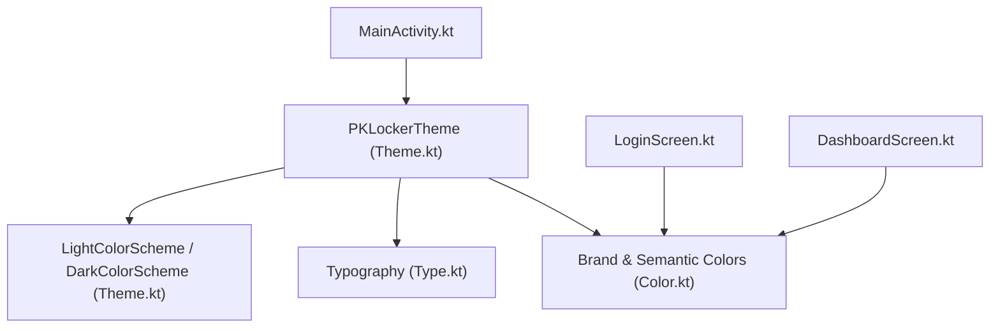
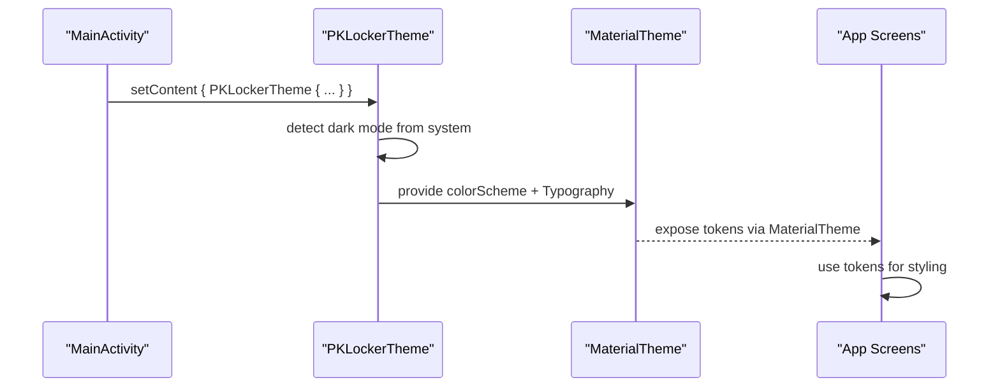
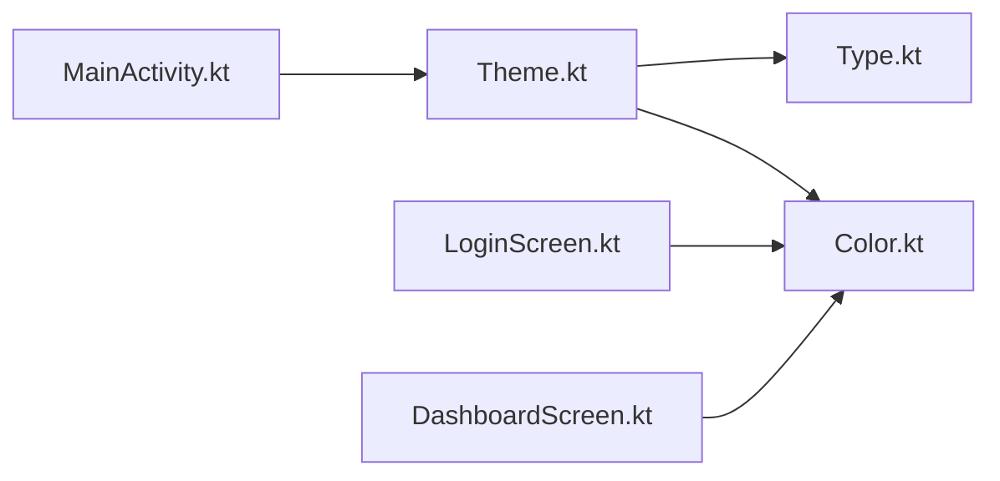

# Theme System

<cite>
**Referenced Files in This Document**
- [Color.kt](file://app/src/main/java/com/pksafe/lock/manager/ui/theme/Color.kt)
- [Theme.kt](file://app/src/main/java/com/pksafe/lock/manager/ui/theme/Theme.kt)
- [Type.kt](file://app/src/main/java/com/pksafe/lock/manager/ui/theme/Type.kt)
- [MainActivity.kt](file://app/src/main/java/com/pksafe/lock/manager/MainActivity.kt)
- [LoginScreen.kt](file://app/src/main/java/com/pksafe/lock/manager/ui/login/LoginScreen.kt)
- [DashboardScreen.kt](file://app/src/main/java/com/pksafe/lock/manager/ui/dashboard/DashboardScreen.kt)
- [themes.xml](file://app/src/main/res/values/themes.xml)
- [colors.xml](file://app/src/main/res/values/colors.xml)
</cite>

## Table of Contents
1. [Introduction](#introduction)
2. [Project Structure](#project-structure)
3. [Core Components](#core-components)
4. [Architecture Overview](#architecture-overview)
5. [Detailed Component Analysis](#detailed-component-analysis)
6. [Dependency Analysis](#dependency-analysis)
7. [Performance Considerations](#performance-considerations)
8. [Troubleshooting Guide](#troubleshooting-guide)
9. [Conclusion](#conclusion)
10. [Appendices](#appendices)

## Introduction
This document explains PK Locker’s Material Design 3 theme system implemented with Jetpack Compose. It covers color palette definitions, semantic color mappings for light and dark themes, typography tokens, theme composition structure, customization options, dark mode behavior, usage examples in custom components, and accessibility considerations for contrast and text sizing.

## Project Structure
The theme system is organized under the ui/theme package and applied at the app entry point:
- Color definitions and brand tokens are centralized in a dedicated file.
- Light and dark color schemes are defined and composed into a single theme composable.
- Typography tokens are defined separately for reuse across screens.
- The root activity wraps the entire UI tree with the theme to propagate tokens consistently.

**Diagram sources**
- [MainActivity.kt:85-88](file://app/src/main/java/com/pksafe/lock/manager/MainActivity.kt#L85-L88)
- [Theme.kt:9-33](file://app/src/main/java/com/pksafe/lock/manager/ui/theme/Theme.kt#L9-L33)
- [Type.kt:9-17](file://app/src/main/java/com/pksafe/lock/manager/ui/theme/Type.kt#L9-L17)
- [Color.kt:5-20](file://app/src/main/java/com/pksafe/lock/manager/ui/theme/Color.kt#L5-L20)

**Section sources**
- [MainActivity.kt:85-88](file://app/src/main/java/com/pksafe/lock/manager/MainActivity.kt#L85-L88)
- [Theme.kt:9-33](file://app/src/main/java/com/pksafe/lock/manager/ui/theme/Theme.kt#L9-L33)
- [Type.kt:9-17](file://app/src/main/java/com/pksafe/lock/manager/ui/theme/Type.kt#L9-L17)
- [Color.kt:5-20](file://app/src/main/java/com/pksafe/lock/manager/ui/theme/Color.kt#L5-L20)

## Core Components
- Color tokens: Brand and semantic colors are defined as reusable constants for consistent use across screens.
- Theme composition: PKLockerTheme selects light or dark scheme based on system preference and injects both colorScheme and Typography into MaterialTheme.
- Typography: A base Typography instance defines bodyLarge style with font family, weight, size, line height, and letter spacing.

Key responsibilities:
- Centralize colors and typography to avoid ad-hoc values in screens.
- Provide automatic dark mode via system preference detection.
- Expose tokens through MaterialTheme so all composables can consume them.

**Section sources**
- [Color.kt:5-20](file://app/src/main/java/com/pksafe/lock/manager/ui/theme/Color.kt#L5-L20)
- [Theme.kt:9-33](file://app/src/main/java/com/pksafe/lock/manager/ui/theme/Theme.kt#L9-L33)
- [Type.kt:9-17](file://app/src/main/java/com/pksafe/lock/manager/ui/theme/Type.kt#L9-L17)

## Architecture Overview
The theme architecture follows a top-down composition model:
- MainActivity sets up edge-to-edge and wraps content with PKLockerTheme.
- PKLockerTheme chooses the appropriate colorScheme (light/dark) and applies Typography.
- Screens consume MaterialTheme tokens or brand tokens directly where needed.

**Diagram sources**
- [MainActivity.kt:85-88](file://app/src/main/java/com/pksafe/lock/manager/MainActivity.kt#L85-L88)
- [Theme.kt:21-33](file://app/src/main/java/com/pksafe/lock/manager/ui/theme/Theme.kt#L21-L33)

## Detailed Component Analysis

### Color Palette and Semantic Mapping
- Brand colors: A set of brand-specific colors is defined for consistent visual identity.
- Semantic colors: Success and error colors are provided for feedback states.
- Material defaults: Light and dark palettes include primary, secondary, and tertiary tokens used by Material components.

Notes:
- Light and dark schemes are defined separately and selected automatically.
- Some screens define local fixed colors to preserve design intent; these coexist with theme tokens.

**Section sources**
- [Color.kt:5-20](file://app/src/main/java/com/pksafe/lock/manager/ui/theme/Color.kt#L5-L20)
- [Theme.kt:9-19](file://app/src/main/java/com/pksafe/lock/manager/ui/theme/Theme.kt#L9-L19)
- [LoginScreen.kt:33-38](file://app/src/main/java/com/pksafe/lock/manager/ui/login/LoginScreen.kt#L33-L38)
- [DashboardScreen.kt:28-34](file://app/src/main/java/com/pksafe/lock/manager/ui/dashboard/DashboardScreen.kt#L28-L34)

### Typography System
- Base typography token: bodyLarge defines default text appearance including font family, weight, size, line height, and letter spacing.
- Usage: Screens can rely on Material’s typography tokens or apply explicit styles when necessary.

Recommendation:
- Prefer Material typography tokens (e.g., headlineLarge, labelSmall) for consistency; extend only when required.

**Section sources**
- [Type.kt:9-17](file://app/src/main/java/com/pksafe/lock/manager/ui/theme/Type.kt#L9-L17)

### Theme Composition and Application
- Root application: MainActivity wraps the entire UI with PKLockerTheme to ensure consistent styling.
- Theme selection: PKLockerTheme detects system dark mode and switches colorScheme accordingly.
- Token propagation: MaterialTheme provides colorScheme and Typography to all descendant composables.

Usage example:
- Buttons and other components can consume MaterialTheme.colorScheme.primary for interactive elements.

**Section sources**
- [MainActivity.kt:85-88](file://app/src/main/java/com/pksafe/lock/manager/MainActivity.kt#L85-L88)
- [Theme.kt:21-33](file://app/src/main/java/com/pksafe/lock/manager/ui/theme/Theme.kt#L21-L33)
- [MainActivity.kt:843-843](file://app/src/main/java/com/pksafe/lock/manager/MainActivity.kt#L843-L843)

### Customization Options
To extend the theme system with brand-specific colors and fonts:
- Add new color tokens in the color file and map them into light/dark schemes if they should participate in theme switching.
- Extend Typography by adding new TextStyle entries or overriding existing ones for brand-specific type scales.
- If you need screen-level overrides, keep them localized and prefer theme tokens for global changes.

Guidelines:
- Keep brand colors separate from semantic colors to maintain clarity.
- Ensure sufficient contrast between foreground and background colors for both light and dark modes.

**Section sources**
- [Color.kt:5-20](file://app/src/main/java/com/pksafe/lock/manager/ui/theme/Color.kt#L5-L20)
- [Theme.kt:9-33](file://app/src/main/java/com/pksafe/lock/manager/ui/theme/Theme.kt#L9-L33)
- [Type.kt:9-17](file://app/src/main/java/com/pksafe/lock/manager/ui/theme/Type.kt#L9-L17)

### Dark Mode Implementation and Automatic Switching
- Automatic detection: PKLockerTheme uses system dark mode state to choose the correct colorScheme.
- Consistent experience: All composables inside the theme inherit the active scheme without additional logic in screens.

Behavior:
- When the user changes system theme, the app updates automatically due to recomposition triggered by the theme wrapper.

**Section sources**
- [Theme.kt:21-33](file://app/src/main/java/com/pksafe/lock/manager/ui/theme/Theme.kt#L21-L33)

### Using Theme Tokens in Custom Components
Examples of token usage patterns:
- Use MaterialTheme.colorScheme.primary for interactive elements like buttons to align with the active theme.
- Reference brand tokens for branding accents while keeping semantic tokens for feedback states.
- Apply Typography tokens for headings and body text to maintain scale and rhythm.

Best practices:
- Avoid hardcoding colors in screens; prefer tokens to ensure consistency across light and dark modes.
- For complex layouts that require fixed visuals, isolate those decisions locally and document why tokens cannot be used.

**Section sources**
- [MainActivity.kt:843-843](file://app/src/main/java/com/pksafe/lock/manager/MainActivity.kt#L843-L843)
- [LoginScreen.kt:33-38](file://app/src/main/java/com/pksafe/lock/manager/ui/login/LoginScreen.kt#L33-L38)
- [DashboardScreen.kt:28-34](file://app/src/main/java/com/pksafe/lock/manager/ui/dashboard/DashboardScreen.kt#L28-L34)

### Accessibility Considerations
- Color contrast: Ensure foreground/background combinations meet contrast guidelines in both light and dark themes. Prefer high-contrast tokens for critical information.
- Text sizing: Use scalable text sizes and respect system text scaling settings. Define line heights and letter spacing for readability.
- Focus and semantics: Provide meaningful content descriptions for icons and images to support screen readers.

Recommendations:
- Test color combinations in both themes using accessibility tools.
- Avoid relying solely on color to convey meaning; pair with icons or labels.

[No sources needed since this section provides general guidance]

## Dependency Analysis
The theme system has minimal dependencies and clear boundaries:
- MainActivity depends on PKLockerTheme to wrap the UI tree.
- PKLockerTheme depends on color schemes and Typography definitions.
- Screens depend on either MaterialTheme tokens or brand tokens.

**Diagram sources**
- [MainActivity.kt:85-88](file://app/src/main/java/com/pksafe/lock/manager/MainActivity.kt#L85-L88)
- [Theme.kt:9-33](file://app/src/main/java/com/pksafe/lock/manager/ui/theme/Theme.kt#L9-L33)
- [Color.kt:5-20](file://app/src/main/java/com/pksafe/lock/manager/ui/theme/Color.kt#L5-L20)
- [Type.kt:9-17](file://app/src/main/java/com/pksafe/lock/manager/ui/theme/Type.kt#L9-L17)
- [LoginScreen.kt:33-38](file://app/src/main/java/com/pksafe/lock/manager/ui/login/LoginScreen.kt#L33-L38)
- [DashboardScreen.kt:28-34](file://app/src/main/java/com/pksafe/lock/manager/ui/dashboard/DashboardScreen.kt#L28-L34)

**Section sources**
- [MainActivity.kt:85-88](file://app/src/main/java/com/pksafe/lock/manager/MainActivity.kt#L85-L88)
- [Theme.kt:9-33](file://app/src/main/java/com/pksafe/lock/manager/ui/theme/Theme.kt#L9-L33)
- [Color.kt:5-20](file://app/src/main/java/com/pksafe/lock/manager/ui/theme/Color.kt#L5-L20)
- [Type.kt:9-17](file://app/src/main/java/com/pksafe/lock/manager/ui/theme/Type.kt#L9-L17)

## Performance Considerations
- Theme recomposition: PKLockerTheme recomposes when system dark mode changes; keep it lightweight to avoid unnecessary recalculations.
- Token usage: Prefer tokens over computed colors in hot paths to reduce layout work.
- Fixed colors: Be cautious with hardcoded colors in frequently redrawn components; consider tokens for better maintainability.

[No sources needed since this section provides general guidance]

## Troubleshooting Guide
Common issues and resolutions:
- Inconsistent colors across screens: Ensure you are using theme tokens instead of hardcoded values.
- Dark mode not applying: Verify that PKLockerTheme wraps the content and that no parent surfaces override colors.
- Low contrast in dark mode: Adjust semantic colors or add elevation/shadows to improve legibility.

Checklist:
- Confirm PKLockerTheme is applied at the root.
- Validate color contrast ratios for both themes.
- Review any local color overrides that might bypass theme tokens.

**Section sources**
- [Theme.kt:21-33](file://app/src/main/java/com/pksafe/lock/manager/ui/theme/Theme.kt#L21-L33)
- [Color.kt:5-20](file://app/src/main/java/com/pksafe/lock/manager/ui/theme/Color.kt#L5-L20)

## Conclusion
PK Locker’s theme system centralizes colors and typography, applies Material Design 3 tokens, and supports automatic dark mode. By using theme tokens consistently and following accessibility best practices, the app maintains a cohesive, scalable, and inclusive user interface. Extending the theme with brand-specific colors and fonts is straightforward while preserving semantic clarity and contrast requirements.

[No sources needed since this section summarizes without analyzing specific files]

## Appendices

### Legacy Android Themes and Colors
- XML-based theme and color resources exist for compatibility but are not used by the Compose UI layer.

**Section sources**
- [themes.xml:4-4](file://app/src/main/res/values/themes.xml#L4-L4)
- [colors.xml:3-9](file://app/src/main/res/values/colors.xml#L3-L9)