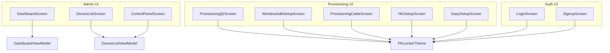
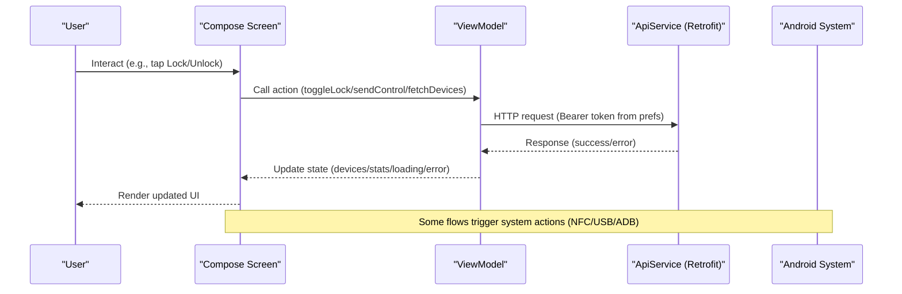
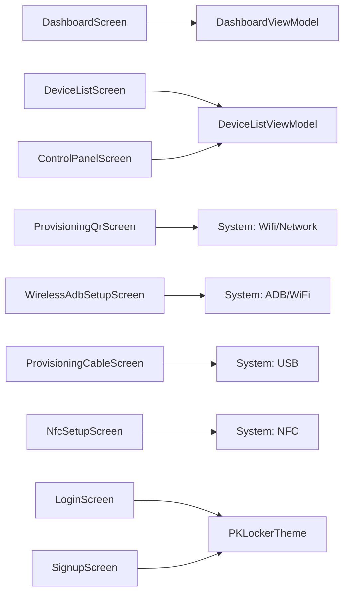

# User Interface

<cite>
**Referenced Files in This Document**
- [DashboardScreen.kt](file://app/src/main/java/com/pksafe/lock/manager/ui/dashboard/DashboardScreen.kt)
- [DashboardViewModel.kt](file://app/src/main/java/com/pksafe/lock/manager/ui/dashboard/DashboardViewModel.kt)
- [DeviceListScreen.kt](file://app/src/main/java/com/pksafe/lock/manager/ui/devices/DeviceListScreen.kt)
- [ControlPanelScreen.kt](file://app/src/main/java/com/pksafe/lock/manager/ui/devices/ControlPanelScreen.kt)
- [DeviceListViewModel.kt](file://app/src/main/java/com/pksafe/lock/manager/ui/devices/DeviceListViewModel.kt)
- [EasySetupScreen.kt](file://app/src/main/java/com/pksafe/lock/manager/ui/provisioning/EasySetupScreen.kt)
- [ProvisioningQrScreen.kt](file://app/src/main/java/com/pksafe/lock/manager/ui/provisioning/ProvisioningQrScreen.kt)
- [WirelessAdbSetupScreen.kt](file://app/src/main/java/com/pksafe/lock/manager/ui/provisioning/WirelessAdbSetupScreen.kt)
- [ProvisioningCableScreen.kt](file://app/src/main/java/com/pksafe/lock/manager/ui/provisioning/ProvisioningCableScreen.kt)
- [NfcSetupScreen.kt](file://app/src/main/java/com/pksafe/lock/manager/ui/provisioning/NfcSetupScreen.kt)
- [LoginScreen.kt](file://app/src/main/java/com/pksafe/lock/manager/ui/login/LoginScreen.kt)
- [SignupScreen.kt](file://app/src/main/java/com/pksafe/lock/manager/ui/login/SignupScreen.kt)
- [Theme.kt](file://app/src/main/java/com/pksafe/lock/manager/ui/theme/Theme.kt)
</cite>

## Table of Contents
1. Introduction
2. Project Structure
3. Core Components
4. Architecture Overview
5. Detailed Component Analysis
6. Dependency Analysis
7. Performance Considerations
8. Troubleshooting Guide
9. Conclusion

## Introduction
This document describes the Jetpack Compose-based user interface for PK Locker, focusing on:
- Admin dashboard for device inventory management, bulk operations, and analytics display
- Customer-facing interfaces including status display, payment information, and lock screen overlay setup
- Provisioning system interfaces supporting QR code enrollment, NFC setup, manual installation, and wireless ADB configuration
It also covers visual appearance, interaction patterns, responsive design, props/attributes, events, customization options, accessibility, cross-device compatibility, and performance optimization techniques used across screens.

## Project Structure
The UI is organized by feature areas under ui/:
- dashboard: Admin overview, stats, quick actions
- devices: Device list, control panel, EMI ledger
- provisioning: Multiple flows to enroll and configure customer devices
- login/signup: Authentication entry points
- theme: Material 3 theming

**Diagram sources**
- [DashboardScreen.kt:35-429](file://app/src/main/java/com/pksafe/lock/manager/ui/dashboard/DashboardScreen.kt#L35-L429)
- [DeviceListScreen.kt:36-190](file://app/src/main/java/com/pksafe/lock/manager/ui/devices/DeviceListScreen.kt#L36-L190)
- [ControlPanelScreen.kt:53-230](file://app/src/main/java/com/pksafe/lock/manager/ui/devices/ControlPanelScreen.kt#L53-L230)
- [EasySetupScreen.kt:40-223](file://app/src/main/java/com/pksafe/lock/manager/ui/provisioning/EasySetupScreen.kt#L40-L223)
- [ProvisioningQrScreen.kt:40-381](file://app/src/main/java/com/pksafe/lock/manager/ui/provisioning/ProvisioningQrScreen.kt#L40-L381)
- [WirelessAdbSetupScreen.kt:51-488](file://app/src/main/java/com/pksafe/lock/manager/ui/provisioning/WirelessAdbSetupScreen.kt#L51-L488)
- [ProvisioningCableScreen.kt:87-396](file://app/src/main/java/com/pksafe/lock/manager/ui/provisioning/ProvisioningCableScreen.kt#L87-L396)
- [NfcSetupScreen.kt:27-130](file://app/src/main/java/com/pksafe/lock/manager/ui/provisioning/NfcSetupScreen.kt#L27-L130)
- [LoginScreen.kt:39-215](file://app/src/main/java/com/pksafe/lock/manager/ui/login/LoginScreen.kt#L39-L215)
- [SignupScreen.kt:26-216](file://app/src/main/java/com/pksafe/lock/manager/ui/login/SignupScreen.kt#L26-L216)
- [Theme.kt:21-33](file://app/src/main/java/com/pksafe/lock/manager/ui/theme/Theme.kt#L21-L33)

**Section sources**
- [DashboardScreen.kt:35-429](file://app/src/main/java/com/pksafe/lock/manager/ui/dashboard/DashboardScreen.kt#L35-L429)
- [DeviceListScreen.kt:36-190](file://app/src/main/java/com/pksafe/lock/manager/ui/devices/DeviceListScreen.kt#L36-L190)
- [ControlPanelScreen.kt:53-230](file://app/src/main/java/com/pksafe/lock/manager/ui/devices/ControlPanelScreen.kt#L53-L230)
- [EasySetupScreen.kt:40-223](file://app/src/main/java/com/pksafe/lock/manager/ui/provisioning/EasySetupScreen.kt#L40-L223)
- [ProvisioningQrScreen.kt:40-381](file://app/src/main/java/com/pksafe/lock/manager/ui/provisioning/ProvisioningQrScreen.kt#L40-L381)
- [WirelessAdbSetupScreen.kt:51-488](file://app/src/main/java/com/pksafe/lock/manager/ui/provisioning/WirelessAdbSetupScreen.kt#L51-L488)
- [ProvisioningCableScreen.kt:87-396](file://app/src/main/java/com/pksafe/lock/manager/ui/provisioning/ProvisioningCableScreen.kt#L87-L396)
- [NfcSetupScreen.kt:27-130](file://app/src/main/java/com/pksafe/lock/manager/ui/provisioning/NfcSetupScreen.kt#L27-L130)
- [LoginScreen.kt:39-215](file://app/src/main/java/com/pksafe/lock/manager/ui/login/LoginScreen.kt#L39-L215)
- [SignupScreen.kt:26-216](file://app/src/main/java/com/pksafe/lock/manager/ui/login/SignupScreen.kt#L26-L216)
- [Theme.kt:21-33](file://app/src/main/java/com/pksafe/lock/manager/ui/theme/Theme.kt#L21-L33)

## Core Components
- DashboardScreen: Admin overview with stats, premium banner, quick actions (QR, NFC, Wireless ADB, Cable), support card, and share APK functionality.
- DeviceListScreen: Searchable device list with lock/unlock confirmations, EMI bottom sheet, and navigation to Control Panel.
- ControlPanelScreen: Tabbed admin panel for security controls, hardware info, live tracker, customer profile, EMI ledger; includes SMS offline mode and emergency reset.
- Provisioning screens: Easy Setup (APK share/manual install), QR Enrollment (local/cloud server), Wireless ADB (pairing + device owner), Cable Activation (USB), NFC Setup (beam).
- Auth screens: Login and Signup with consistent form inputs and error handling.

Key state and data flow are managed via ViewModels that call a shared API service using Retrofit.

**Section sources**
- [DashboardScreen.kt:35-429](file://app/src/main/java/com/pksafe/lock/manager/ui/dashboard/DashboardScreen.kt#L35-L429)
- [DeviceListScreen.kt:36-190](file://app/src/main/java/com/pksafe/lock/manager/ui/devices/DeviceListScreen.kt#L36-L190)
- [ControlPanelScreen.kt:53-230](file://app/src/main/java/com/pksafe/lock/manager/ui/devices/ControlPanelScreen.kt#L53-L230)
- [DeviceListViewModel.kt:18-246](file://app/src/main/java/com/pksafe/lock/manager/ui/devices/DeviceListViewModel.kt#L18-L246)
- [DashboardViewModel.kt:16-66](file://app/src/main/java/com/pksafe/lock/manager/ui/dashboard/DashboardViewModel.kt#L16-L66)

## Architecture Overview
The UI follows a MVVM pattern with Compose screens delegating network and business logic to ViewModels. Screens consume state via mutableStateOf and react to changes. Provisioning flows integrate with Android system APIs (NFC, USB, ADB, Wi-Fi) and third-party libraries (ZXing for QR). Theming uses Material 3 with custom color tokens.

**Diagram sources**
- [DeviceListViewModel.kt:33-64](file://app/src/main/java/com/pksafe/lock/manager/ui/devices/DeviceListViewModel.kt#L33-L64)
- [DeviceListViewModel.kt:143-171](file://app/src/main/java/com/pksafe/lock/manager/ui/devices/DeviceListViewModel.kt#L143-L171)
- [DashboardViewModel.kt:32-64](file://app/src/main/java/com/pksafe/lock/manager/ui/dashboard/DashboardViewModel.kt#L32-L64)

## Detailed Component Analysis

### Admin Dashboard (DashboardScreen)
- Visual appearance: Clean header with avatar/logo, shop name/phone, verified badge; premium banner showing protection features; stats cards for Android/iOS keys; grid of quick actions; support card.
- Interaction patterns: Share APK via system share sheet; refresh stats; navigate to Wireless ADB or Cable activation; open QR/NFC flows; view EMIs and buy keys.
- Responsive design: Uses vertical scroll, flexible Row/Column layouts, weight distribution for two-column grids, adaptive spacing.
- Props/attributes: onMenuItemClick callback; viewModel instance; internal state for loading and errors.
- Events: LaunchedEffect initializes dashboard; IconButton triggers share or refresh; ActionGridItem handles navigation or “Coming Soon” feedback.
- Customization: Fixed color palette constants ensure consistent look; Card elevation and shapes define hierarchy.

Usage example references:
- Initialize dashboard and fetch stats: [DashboardScreen.kt:43-46](file://app/src/main/java/com/pksafe/lock/manager/ui/dashboard/DashboardScreen.kt#L43-L46), [DashboardViewModel.kt:32-44](file://app/src/main/java/com/pksafe/lock/manager/ui/dashboard/DashboardViewModel.kt#L32-L44)
- Share APK flow: [DashboardScreen.kt:121-155](file://app/src/main/java/com/pksafe/lock/manager/ui/dashboard/DashboardScreen.kt#L121-L155)
- Stats cards rendering: [DashboardScreen.kt:244-266](file://app/src/main/java/com/pksafe/lock/manager/ui/dashboard/DashboardScreen.kt#L244-L266)

Accessibility notes:
- Images use contentDescription attributes for screen readers.
- Buttons and icons have descriptive labels where applicable.

Performance considerations:
- Lazy scrolling with rememberScrollState; minimal recomposition via scoped state.
- Network calls isolated in ViewModel scope.

**Section sources**
- [DashboardScreen.kt:35-429](file://app/src/main/java/com/pksafe/lock/manager/ui/dashboard/DashboardScreen.kt#L35-L429)
- [DashboardViewModel.kt:16-66](file://app/src/main/java/com/pksafe/lock/manager/ui/dashboard/DashboardViewModel.kt#L16-L66)

### Device Inventory Management (DeviceListScreen)
- Visual appearance: Modern search bar, premium device cards with status badges, action buttons for detail, EMI, lock/unlock.
- Interaction patterns: Search filtering; lock/unlock confirmation dialog; open EMI bottom sheet; pull-to-refresh indicator; empty state with refresh action.
- Responsive design: Scaffold with top app bar; LazyColumn for efficient list rendering; responsive spacing and typography.
- Props/attributes: onDeviceClick callback; viewModel instance; local states for dialogs and selection.
- Events: LaunchedEffect fetches devices; confirm dialog triggers toggleLock; EMI sheet opens schedule and allows mark-as-paid or reschedule.

Usage example references:
- Fetch devices on start: [DeviceListScreen.kt:51-54](file://app/src/main/java/com/pksafe/lock/manager/ui/devices/DeviceListScreen.kt#L51-L54)
- Lock/Unlock confirmation: [DeviceListScreen.kt:56-81](file://app/src/main/java/com/pksafe/lock/manager/ui/devices/DeviceListScreen.kt#L56-L81)
- EMI bottom sheet: [DeviceListScreen.kt:176-189](file://app/src/main/java/com/pksafe/lock/manager/ui/devices/DeviceListScreen.kt#L176-L189)

Accessibility notes:
- Dialogs provide clear titles and confirm/cancel actions.
- Status badges use color contrast and text labels.

Performance considerations:
- Filtering performed locally on fetched list; LazyColumn reduces memory footprint.

**Section sources**
- [DeviceListScreen.kt:36-190](file://app/src/main/java/com/pksafe/lock/manager/ui/devices/DeviceListScreen.kt#L36-L190)
- [DeviceListViewModel.kt:33-64](file://app/src/main/java/com/pksafe/lock/manager/ui/devices/DeviceListViewModel.kt#L33-L64)

### Control Panel (ControlPanelScreen)
- Visual appearance: Tabbed interface (Secure Control, Hardware Tech, Live Tracker, Customer Profile, EMI Ledger); dark/light sections; prominent lock/release buttons at bottom.
- Interaction patterns: Toggle modes (Online/Offline); switch controls (auto-lock, USB block, camera block, app restrictions); trigger utilities (location ping, warning audio/wallpaper); SMS offline commands; de-register terminal with confirmation.
- Responsive design: Scrollable content within tabs; compact headers; consistent card groups.
- Props/attributes: imei, customerName, onBack; viewModel instance; selectedTab state; online/offline mode state.
- Events: Confirm dialogs for destructive actions; sendControl updates remote device; SMS intents open messaging apps.

Usage example references:
- Tabs and mode switching: [ControlPanelScreen.kt:146-168](file://app/src/main/java/com/pksafe/lock/manager/ui/devices/ControlPanelScreen.kt#L146-L168)
- Security controls group: [ControlPanelScreen.kt:310-345](file://app/src/main/java/com/pksafe/lock/manager/ui/devices/ControlPanelScreen.kt#L310-L345)
- Offline SMS tab: [ControlPanelScreen.kt:572-623](file://app/src/main/java/com/pksafe/lock/manager/ui/devices/ControlPanelScreen.kt#L572-L623)

Accessibility notes:
- Switch items include labels and icons; dialogs require explicit confirmation for critical actions.

Performance considerations:
- Each tab renders only when selected; progress indicators avoid blocking UI.

**Section sources**
- [ControlPanelScreen.kt:53-230](file://app/src/main/java/com/pksafe/lock/manager/ui/devices/ControlPanelScreen.kt#L53-L230)
- [ControlPanelScreen.kt:250-494](file://app/src/main/java/com/pksafe/lock/manager/ui/devices/ControlPanelScreen.kt#L250-L494)
- [ControlPanelScreen.kt:572-623](file://app/src/main/java/com/pksafe/lock/manager/ui/devices/ControlPanelScreen.kt#L572-L623)
- [DeviceListViewModel.kt:173-195](file://app/src/main/java/com/pksafe/lock/manager/ui/devices/DeviceListViewModel.kt#L173-L195)

### Provisioning: QR Code Enrollment (ProvisioningQrScreen)
- Visual appearance: Server mode toggle (Local Phone Server vs Cloud Vercel), status card, large QR display, step-by-step instructions, warnings for WiFi connectivity.
- Interaction patterns: Start/stop local server; compute signature and APK hash; generate QR with provisioning extras; refresh status; copy/share QR.
- Responsive design: Scrollable layout; centered QR; adaptive status messages.
- Props/attributes: title, isForInstallation flag, onBack; local states for serverRunning, phoneIp, apkUrl, signature, apkHash, isVerifying, serverStatus, useLocalServer.
- Events: LaunchedEffect toggles server based on mode; DisposableEffect stops server on dispose; QR generation triggered by state changes.

Usage example references:
- Local server start and IP detection: [ProvisioningQrScreen.kt:64-111](file://app/src/main/java/com/pksafe/lock/manager/ui/provisioning/ProvisioningQrScreen.kt#L64-L111)
- QR content assembly: [ProvisioningQrScreen.kt:120-157](file://app/src/main/java/com/pksafe/lock/manager/ui/provisioning/ProvisioningQrScreen.kt#L120-L157)
- QR bitmap generation: [ProvisioningQrScreen.kt:159-169](file://app/src/main/java/com/pksafe/lock/manager/ui/provisioning/ProvisioningQrScreen.kt#L159-L169)

Accessibility notes:
- QR image has contentDescription; status text conveys readiness clearly.

Performance considerations:
- Hash computation runs on IO dispatcher; QR bitmap cached via remember.

**Section sources**
- [ProvisioningQrScreen.kt:40-381](file://app/src/main/java/com/pksafe/lock/manager/ui/provisioning/ProvisioningQrScreen.kt#L40-L381)

### Provisioning: Wireless ADB Setup (WirelessAdbSetupScreen)
- Visual appearance: Step-by-step guide with QR for APK download, input fields for IP:Port and pairing code, status indicator, log window with copy option.
- Interaction patterns: Validate inputs; pair via wireless ADB; set device owner and auto-grant permissions; disconnect; copy logs.
- Responsive design: Vertical scroll; monospace log area; clear step separation.
- Props/attributes: onBack; local states for pairingCode, targetIpPort, isConnected, isPairing, isSettingOwner, logText.
- Events: Button handlers execute remote commands via ADB socket engine; logs appended; Toast feedback.

Usage example references:
- Pair & Connect flow: [WirelessAdbSetupScreen.kt:226-277](file://app/src/main/java/com/pksafe/lock/manager/ui/provisioning/WirelessAdbSetupScreen.kt#L226-L277)
- Set Device Owner and auto-permissions: [WirelessAdbSetupScreen.kt:320-382](file://app/src/main/java/com/pksafe/lock/manager/ui/provisioning/WirelessAdbSetupScreen.kt#L320-L382)
- Log window and copy: [WirelessAdbSetupScreen.kt:425-483](file://app/src/main/java/com/pksafe/lock/manager/ui/provisioning/WirelessAdbSetupScreen.kt#L425-L483)

Accessibility notes:
- Input fields have labels and placeholders; logs are selectable and copyable.

Performance considerations:
- Remote command execution uses coroutines; UI remains responsive with progress indicators.

**Section sources**
- [WirelessAdbSetupScreen.kt:51-488](file://app/src/main/java/com/pksafe/lock/manager/ui/provisioning/WirelessAdbSetupScreen.kt#L51-L488)

### Provisioning: Cable Activation (ProvisioningCableScreen)
- Visual appearance: Dark theme; pulsing status circle; checklist; large ACTIVATE button; console log area with copy.
- Interaction patterns: Detect USB device; request permission; run full setup via USB ADB; show success/failure; persist RSA key pair for trust.
- Responsive design: Scrollable checklist and logs; centered status indicator.
- Props/attributes: onBack; local states for usbDevice, hasUsbPermission, isExecuting, isCompletedSuccess, logText.
- Events: Background loop polls USB device; BroadcastReceiver handles permission result; ACTIVATE triggers UsbAdbEngine.runFullSetup.

Usage example references:
- USB detection and permission request: [ProvisioningCableScreen.kt:111-150](file://app/src/main/java/com/pksafe/lock/manager/ui/provisioning/ProvisioningCableScreen.kt#L111-L150)
- Permission BroadcastReceiver: [ProvisioningCableScreen.kt:153-171](file://app/src/main/java/com/pksafe/lock/manager/ui/provisioning/ProvisioningCableScreen.kt#L153-L171)
- ACTIVATE flow and logging: [ProvisioningCableScreen.kt:294-350](file://app/src/main/java/com/pksafe/lock/manager/ui/provisioning/ProvisioningCableScreen.kt#L294-L350)

Accessibility notes:
- Checklist items use icons and text; logs are readable and copyable.

Performance considerations:
- Polling interval balances responsiveness and battery; background work off main thread.

**Section sources**
- [ProvisioningCableScreen.kt:87-396](file://app/src/main/java/com/pksafe/lock/manager/ui/provisioning/ProvisioningCableScreen.kt#L87-L396)

### Provisioning: NFC Setup (NfcSetupScreen)
- Visual appearance: Large NFC icon, ready-to-bump message, instruction steps card.
- Interaction patterns: Check NFC availability and enablement; attempt NDEF push (noted as deprecated/removed in recent Android versions); guide user through bump process.
- Responsive design: Centered content; scrollable instructions.
- Props/attributes: onBack; local state for NFC adapter.
- Events: LaunchedEffect checks NFC capabilities and shows appropriate Toast messages.

Usage example references:
- NFC capability check and guidance: [NfcSetupScreen.kt:34-45](file://app/src/main/java/com/pksafe/lock/manager/ui/provisioning/NfcSetupScreen.kt#L34-L45)
- Instructions display: [NfcSetupScreen.kt:105-127](file://app/src/main/java/com/pksafe/lock/manager/ui/provisioning/NfcSetupScreen.kt#L105-L127)

Accessibility notes:
- Clear textual instructions; icons complement text.

Performance considerations:
- Minimal runtime work; relies on system NFC stack.

**Section sources**
- [NfcSetupScreen.kt:27-130](file://app/src/main/java/com/pksafe/lock/manager/ui/provisioning/NfcSetupScreen.kt#L27-L130)

### Provisioning: Easy Setup (EasySetupScreen)
- Visual appearance: Step cards with numbered badges, accent colors, and optional action buttons; info box explaining Device Admin vs Device Owner.
- Interaction patterns: Share APK via system share sheet; copy download link; guide user through install, permissions, IMEI entry, completion.
- Responsive design: Scrollable column; consistent card layout.
- Props/attributes: onBack; local context usage for sharing and clipboard.
- Events: Share APK triggers FileProvider and Intent; copy link uses ClipboardManager.

Usage example references:
- Share APK function: [EasySetupScreen.kt:286-313](file://app/src/main/java/com/pksafe/lock/manager/ui/provisioning/EasySetupScreen.kt#L286-L313)
- Step cards and actions: [EasySetupScreen.kt:107-190](file://app/src/main/java/com/pksafe/lock/manager/ui/provisioning/EasySetupScreen.kt#L107-L190)

Accessibility notes:
- Steps include descriptive text and icons; info box clarifies differences.

Performance considerations:
- Lightweight UI; file operations handled in try-catch blocks.

**Section sources**
- [EasySetupScreen.kt:40-223](file://app/src/main/java/com/pksafe/lock/manager/ui/provisioning/EasySetupScreen.kt#L40-L223)
- [EasySetupScreen.kt:286-313](file://app/src/main/java/com/pksafe/lock/manager/ui/provisioning/EasySetupScreen.kt#L286-L313)

### Authentication (LoginScreen, SignupScreen)
- Visual appearance: Premium branding, card-based forms, gradient backgrounds, consistent input styling.
- Interaction patterns: Login with phone/password; navigate to signup; direct access to customer lock screen setup; show loading and errors.
- Responsive design: Scrollable forms; centered content; consistent spacing.
- Props/attributes: onLoginSuccess, onNavigateToSignup, onBackToLogin; viewModel instances for state.
- Events: Login triggers authentication flow; Signup shows success dialog; Customer setup path bypasses auth for quick demo.

Usage example references:
- Login form and submission: [LoginScreen.kt:131-191](file://app/src/main/java/com/pksafe/lock/manager/ui/login/LoginScreen.kt#L131-L191)
- Customer setup shortcut: [LoginScreen.kt:54-73](file://app/src/main/java/com/pksafe/lock/manager/ui/login/LoginScreen.kt#L54-L73)
- Signup form and success dialog: [SignupScreen.kt:89-200](file://app/src/main/java/com/pksafe/lock/manager/ui/login/SignupScreen.kt#L89-L200)

Accessibility notes:
- Inputs have labels and leading icons; password visibility toggle improves usability.

Performance considerations:
- Loading states disable buttons; errors displayed inline.

**Section sources**
- [LoginScreen.kt:39-215](file://app/src/main/java/com/pksafe/lock/manager/ui/login/LoginScreen.kt#L39-L215)
- [SignupScreen.kt:26-216](file://app/src/main/java/com/pksafe/lock/manager/ui/login/SignupScreen.kt#L26-L216)

## Dependency Analysis
- UI components depend on ViewModels for state and network calls.
- ViewModels depend on ApiService (Retrofit) configured with base URL and Gson converter.
- Provisioning screens depend on Android system services (NFC, USB, Wi-Fi) and external libraries (ZXing for QR).
- Theming is centralized via PKLockerTheme using Material 3 color schemes.

**Diagram sources**
- [DashboardViewModel.kt:25-31](file://app/src/main/java/com/pksafe/lock/manager/ui/dashboard/DashboardViewModel.kt#L25-L31)
- [DeviceListViewModel.kt:24-31](file://app/src/main/java/com/pksafe/lock/manager/ui/devices/DeviceListViewModel.kt#L24-L31)
- [ProvisioningQrScreen.kt:64-111](file://app/src/main/java/com/pksafe/lock/manager/ui/provisioning/ProvisioningQrScreen.kt#L64-L111)
- [WirelessAdbSetupScreen.kt:226-277](file://app/src/main/java/com/pksafe/lock/manager/ui/provisioning/WirelessAdbSetupScreen.kt#L226-L277)
- [ProvisioningCableScreen.kt:111-171](file://app/src/main/java/com/pksafe/lock/manager/ui/provisioning/ProvisioningCableScreen.kt#L111-L171)
- [NfcSetupScreen.kt:34-45](file://app/src/main/java/com/pksafe/lock/manager/ui/provisioning/NfcSetupScreen.kt#L34-L45)
- [Theme.kt:21-33](file://app/src/main/java/com/pksafe/lock/manager/ui/theme/Theme.kt#L21-L33)

**Section sources**
- [DashboardViewModel.kt:25-31](file://app/src/main/java/com/pksafe/lock/manager/ui/dashboard/DashboardViewModel.kt#L25-L31)
- [DeviceListViewModel.kt:24-31](file://app/src/main/java/com/pksafe/lock/manager/ui/devices/DeviceListViewModel.kt#L24-L31)
- [ProvisioningQrScreen.kt:64-111](file://app/src/main/java/com/pksafe/lock/manager/ui/provisioning/ProvisioningQrScreen.kt#L64-L111)
- [WirelessAdbSetupScreen.kt:226-277](file://app/src/main/java/com/pksafe/lock/manager/ui/provisioning/WirelessAdbSetupScreen.kt#L226-L277)
- [ProvisioningCableScreen.kt:111-171](file://app/src/main/java/com/pksafe/lock/manager/ui/provisioning/ProvisioningCableScreen.kt#L111-L171)
- [NfcSetupScreen.kt:34-45](file://app/src/main/java/com/pksafe/lock/manager/ui/provisioning/NfcSetupScreen.kt#L34-L45)
- [Theme.kt:21-33](file://app/src/main/java/com/pksafe/lock/manager/ui/theme/Theme.kt#L21-L33)

## Performance Considerations
- Use LazyColumn for large lists to reduce memory usage and improve scrolling performance.
- Offload network and heavy computations to coroutines with Dispatchers.IO.
- Cache computed values (e.g., QR bitmaps, hashes) using remember to avoid recomputation.
- Minimize unnecessary recompositions by scoping state changes and using stable types.
- Provide loading indicators and disable interactive elements during async operations to prevent race conditions.
- For system integrations (USB polling, NFC checks), throttle operations and handle lifecycle events properly.

[No sources needed since this section provides general guidance]

## Troubleshooting Guide
Common issues and resolutions:
- Authentication required: Ensure auth_token exists in preferences before fetching devices or stats.
- Network failures: Display connection failed messages; retry via refresh actions.
- NFC not supported/enabled: Show informative Toasts and guide users to settings.
- USB permission denied: Prompt user to allow permission; re-detect device if cable disconnected.
- Wireless ADB pairing failure: Validate IP:Port format and 6-digit pairing code; verify wireless debugging enabled on target device.
- QR generation delays: Check server status and WiFi connectivity; refresh hash and status.

**Section sources**
- [DeviceListViewModel.kt:33-64](file://app/src/main/java/com/pksafe/lock/manager/ui/devices/DeviceListViewModel.kt#L33-L64)
- [DashboardViewModel.kt:46-64](file://app/src/main/java/com/pksafe/lock/manager/ui/dashboard/DashboardViewModel.kt#L46-L64)
- [NfcSetupScreen.kt:34-45](file://app/src/main/java/com/pksafe/lock/manager/ui/provisioning/NfcSetupScreen.kt#L34-L45)
- [ProvisioningCableScreen.kt:111-171](file://app/src/main/java/com/pksafe/lock/manager/ui/provisioning/ProvisioningCableScreen.kt#L111-L171)
- [WirelessAdbSetupScreen.kt:226-277](file://app/src/main/java/com/pksafe/lock/manager/ui/provisioning/WirelessAdbSetupScreen.kt#L226-L277)
- [ProvisioningQrScreen.kt:64-111](file://app/src/main/java/com/pksafe/lock/manager/ui/provisioning/ProvisioningQrScreen.kt#L64-L111)

## Conclusion
PK Locker’s UI delivers a modern, accessible, and performant experience across admin and customer-facing workflows. The modular Compose architecture, robust state management via ViewModels, and careful integration with Android system APIs enable seamless device provisioning and management. Consistent theming, responsive layouts, and clear user guidance ensure usability across diverse devices and scenarios.

[No sources needed since this section summarizes without analyzing specific files]